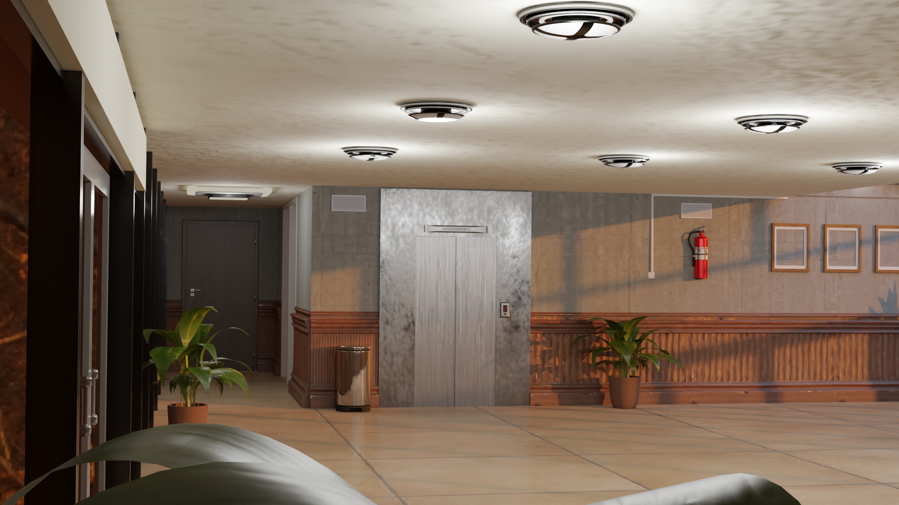

# BACK to USTHB - Modeling Contribution

## Description
This repository contains the modeling assets created using Blender for the game "BACK to USTHB." The game aims to provide an immersive experience where players can explore the virtual campus of USTHB (University of Science and Technology Houari Boumediene) while engaging in various mini-games to familiarize themselves with the university environment.
The links to the .blend files:
  + Exterior:
      https://drive.google.com/file/d/1tsK7y4TB0tt6FjwFH6OKkunn2sK6rdX4/view?usp=drive_link
  + Interior:
      https://drive.google.com/file/d/1Banp7eoy7w3xCvW6V5re8ccQAqtWBNd_/view?usp=drive_link

## Modeling Contribution
As part of this project, my primary contribution was in the 3D modeling and asset creation using Blender (in collaboration with [@NaaaaaaaaaaDaa](https://github.com/NaaaaaaaaaaDaa) ). We meticulously designed and crafted 3D models for various elements within the game, including buildings, structures, props, and environmental assets. Each model was carefully optimized for in-game performance while maintaining visual quality to ensure a smooth and enjoyable gaming experience.

## Some Exterior screenshots

  
  
  
  
  
  
  
  

## Some Interior screenshots

  
  
  
  
  
  
  
  

## Credits
I would like to acknowledge the collaborative efforts of the entire development team for their valuable contributions to the game. The success of this project wouldn't have been possible without the combined skills and dedication of each member.

